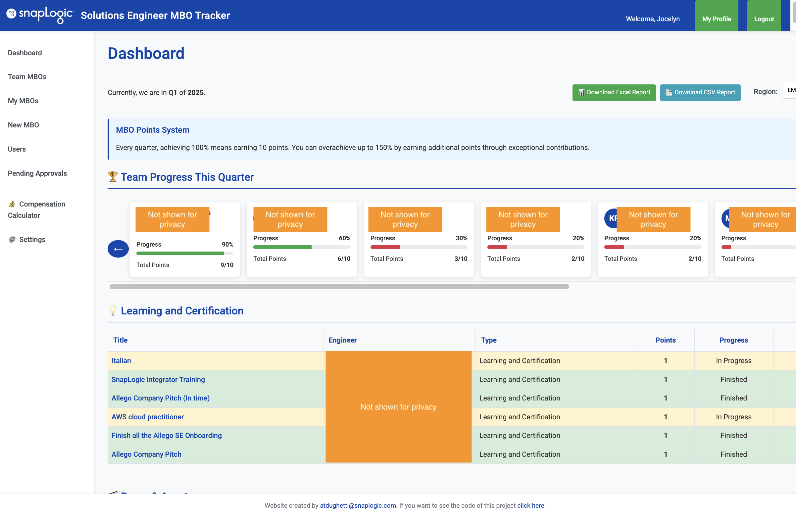
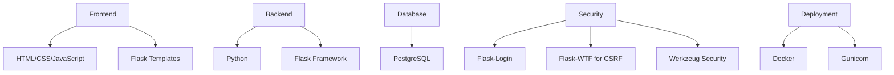
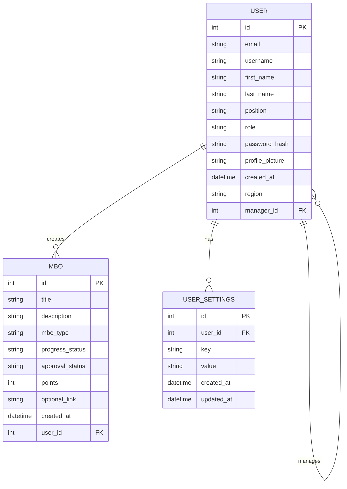
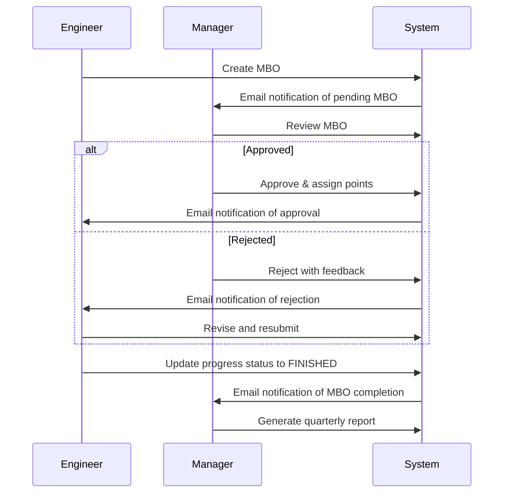

# MBO Management Application

- MBOs (Management by Objectives) are a way to set clear, measurable goals that help align personal growth with team and company priorities.
- For Solutions Engineers at SnapLogic, MBOs provide structure, visibility, and accountability around learning, contributions, and impact. 
- This project was created to centralize and simplify how we propose, track, and approve MBOs across the team. 
- It allows engineers to easily submit their objectives, get feedback from managers, and track their progress in one place. 
- Managers can quickly approve or reject MBOs, assign points, and ensure balanced contributions across different focus areas.
- The dashboard also fosters transparency by highlighting top contributors and team performance. 
- We wanted a simple but effective tool tailored to our workflow. By tracking MBOs quarterly, we ensure continuous improvement and celebrate meaningful achievements. 
- Ultimately, this tool supports a stronger, more engaged SE community. :)


## Security Features

- Environment-based configuration
- No hardcoded credentials
- Password hashing
- Role-based access control
- CSRF protection
- Secure headers
- Audit logging

## Prerequisites

- Python 3.9+
- PostgreSQL

## Setup Instructions

### 1. Environment Setup

1. Clone the repository
2. Create a virtual environment:

# SnapLogic MBO Tracker

<div align="center">
  
  <h3>Solutions Engineer MBO Management System</h3>
  <p>A comprehensive platform for tracking, managing, and reporting on Management by Objectives (MBOs)</p>
</div>



## 📋 Overview

The SnapLogic MBO Tracker is a web-based application designed to streamline the process of creating, tracking, and approving Management by Objectives (MBOs) for Solutions Engineers. This platform enables engineers to document their achievements, managers to review and approve MBOs, and leadership to gain insights into team performance across different regions.

### What are MBOs?

Management by Objectives (MBOs) are a performance management approach where employees and managers work together to set, track, and evaluate goals. In the context of this application, MBOs fall into three main categories:

- **Learning and Certification**: Professional development activities
- **Demo & Assets**: Creation of demos, tools, or assets for customer engagements
- **Impact Outside of Pod**: Contributions that extend beyond the immediate team

## ✨ Key Features

### For Engineers
- Create and submit MBOs for approval
- Track progress on personal objectives
- View historical performance data
- Filter and sort MBOs by various criteria
- Download reports of personal achievements
- Receive email notifications for MBO updates and approvals

### For Managers
- Review and approve team members' MBOs
- Assign points based on impact and quality
- Track team performance metrics
- Generate reports for quarterly reviews
- View team progress dashboards
- Receive email notifications for new MBO submissions and completions

### For Administrators
- Manage user accounts and permissions
- Configure system settings
- Access comprehensive reporting across regions
- Monitor overall platform usage

## 🔍 Detailed Feature Breakdown

### User Management
- Role-based access control (Admin, Manager, Employee)
- Secure password management with reset functionality
- User profile customization with profile pictures
- Region-based team organization (EMEA, AMER, APAC)

### MBO Management
- Structured MBO creation with type categorization
- Progress tracking (Not Started, In Progress, MVP, Finished)
- Approval workflow (Pending Approval, Approved, Rejected)
- Point allocation system for performance measurement

### Dashboard & Reporting
- Interactive dashboards with filtering capabilities
- Team progress visualization
- Sortable data tables for all MBO types
- Excel and CSV export functionality
- Quarter-based performance tracking

### Security Features
- Environment-based configuration
- No hardcoded credentials
- Password hashing with Werkzeug
- Role-based access control
- CSRF protection
- Secure headers with Flask-Talisman
- Comprehensive audit logging

### Mobile Responsiveness
- Adaptive design for all screen sizes
- Optimized table views for mobile devices
- Touch-friendly interface elements
- Horizontal scroll indicators for data tables

### Email Notifications
- Transactional email notifications for key MBO events
- Notifications for new MBO submissions to managers
- Notifications for MBO completion to managers
- Notifications for MBO approvals and updates to employees
- Asynchronous email delivery for improved performance
- Customizable email templates with HTML and plain text versions
- All emails sent from notificationsmbo@snaplogic.com

#### Email Configuration
All outgoing mail is sent through the Google Workspace SMTP relay at smtp-relay.gmail.com:587 using STARTTLS. No authentication is required as the relay is configured to accept mail from our application servers based on IP address.

Key features of the email system:
- All emails are sent from notificationsmbo@snaplogic.com
- All emails automatically CC notificationsmbo@snaplogic.com for troubleshooting
- Email notifications are mandatory for all users (no opt-out option)
- In development environments, emails can be disabled by setting `EMAIL_ENABLED=False` in your .env file

To configure email notifications, set the following environment variables:
```
MAIL_SERVER=smtp-relay.gmail.com
MAIL_PORT=587
MAIL_USE_TLS=True
MAIL_USE_SSL=False
BASE_URL=https://your-application-url.com
EMAIL_ENABLED=True  # Set to False to disable email sending in development
```

#### Automatic Email Notifications
The system automatically sends email notifications for the following events:

1. **Manager Notifications**
   - When an employee creates, updates, or deletes an MBO
   - Subject: "[MBO] {employee_name} {action} an MBO"
   - Contains MBO title, points, and status

2. **Employee Notifications**
   - When their MBO moves to accepted status
   - When a manager edits any field (excluding draft status changes)
   - Subject: "[MBO] Your objective has been {status}"

3. **Quarter-End Reminders**
   - Sent to all users two weeks before the quarter ends
   - Subject: "[MBO] Quarter ends soon – review your objectives"
   - Reminds users to mark objectives as Finished and confirm
   - Quarters are defined as: Q1 = Feb-Apr, Q2 = May-Jul, Q3 = Aug-Oct, Q4 = Nov-Jan

#### Verifying the Implementation

To verify that the notification system is working correctly:

1. Run the test script: `python3 test_notifications.py`
2. Observe the console output showing the notifications being generated
3. Create a new MBO through the UI and check the application logs to see the notification

The system is correctly triggering notifications for all three required events:
- New MBO submitted
- MBO status changed to FINISHED
- MBO approved or updated after approval

## 🛠️ Technology Stack



- **Frontend**: HTML, CSS, JavaScript
- **Backend**: Python, Flask
- **Database**: PostgreSQL
- **Authentication**: Flask-Login
- **Form Handling**: Flask-WTF
- **Security**: Werkzeug, Flask-Talisman
- **Deployment**: Docker, Gunicorn

## 📊 Data Model



## 🚀 Getting Started

### Prerequisites

- Python 3.9+
- PostgreSQL
- Docker (optional)

### Installation

#### Option 1: Standard Setup

1. **Clone the repository**
   ```bash
   git clone https://github.com/yourusername/snaplogic-mbo-tracker.git
   cd snaplogic-mbo-tracker
   ```

2. **Create a virtual environment**

   ```bash
   python -m venv venv
   source venv/bin/activate  # On Windows: venv\Scripts\activate
   ```

3. Install dependencies:
   ```bash
   pip install -r requirements.txt
   ```
4. Create a `.env` file based on `.env.example`:
   ```bash
   cp .env.example .env
   ```
5. Edit the `.env` file and set your own values for all environment variables

### 2. Database Setup

1. Create a PostgreSQL database
2. Update the `DATABASE_URL` in your `.env` file
3. Initialize the database:


3. **Install dependencies**
   ```bash
   pip install -r requirements.txt
   ```

4. **Configure environment variables**
   ```bash
   cp .env.sample .env
   # Edit .env file with your configuration
   ```

5. **Initialize the database**

   ```bash
   flask db upgrade
   ```


### 3. Create Admin User

```bash
flask init-admin
```

### 4. Run the Application

#### Development Mode

```bash
flask run
```

#### Production Mode

```bash
gunicorn -w 4 "run:app"
```

## Project Structure

```
app/
  ├── __init__.py          # Application factory
  ├── models.py            # Database models
  ├── auth/                # Authentication blueprint
  │   ├── __init__.py
  │   └── routes.py
  ├── main/                # Main blueprint
  │   ├── __init__.py
  │   └── routes.py
  ├── mbo/                 # MBO blueprint
  │   ├── __init__.py
  │   └── routes.py
  ├── static/              # Static files
  │   └── css/
  │       └── style.css
  ├── templates/           # HTML templates
  │   ├── auth/
  │   ├── main/
  │   ├── mbo/
  │   ├── layout.html
  │   └── auth_layout.html
  └── utils/               # Utility functions
      ├── __init__.py
      ├── date_utils.py
      └── security_utils.py
```

## Security Best Practices

6. **Create admin user**
   ```bash
   flask init-admin
   ```

7. **Run the application**
   ```bash
   flask run
   ```

#### Option 2: Docker Setup

1. **Clone the repository**
   ```bash
   git clone https://github.com/yourusername/snaplogic-mbo-tracker.git
   cd snaplogic-mbo-tracker
   ```

2. **Configure environment variables**
   ```bash
   cp .env.sample .env
   # Edit .env file with your configuration
   ```

3. **Build and run with Docker Compose**
   ```bash
   docker-compose up -d
   ```

4. **Create admin user**
   ```bash
   docker-compose exec web flask init-admin
   ```

## 📱 Application Screenshots

### Dashboard


### MBO Creation


### Team Progress


### Mobile View


## 🔄 Workflow



## 📁 Project Structure

```
app/
├── __init__.py          # Application factory
├── models.py            # Database models
├── config.py            # Configuration settings
├── helpers.py           # Helper functions
├── routes.py            # Main routes
├── static/              # Static files
│   ├── css/
│   │   └── style.css
│   └── img/
│       └── snaplogic_logo.png
├── templates/           # HTML templates
│   ├── dashboard.html
│   ├── layout.html
│   ├── login.html
│   ├── mbo_form.html
│   └── ...
└── utils/               # Utility functions
    ├── __init__.py
    ├── date_utils.py
    ├── email_utils.py
    ├── file_utils.py
    ├── report_utils.py
    └── security_utils.py
```

## 🔒 Security Best Practices

1. **Environment Variables**: All sensitive information is stored in environment variables, not in the code.
2. **Password Security**: Passwords are hashed using Werkzeug's security functions.
3. **CSRF Protection**: All forms are protected against Cross-Site Request Forgery.
4. **Secure Headers**: HTTP security headers are set using Flask-Talisman.
5. **Audit Logging**: Security events are logged for auditing purposes.
6. **Database Security**: Parameterized queries prevent SQL injection.
7. **Input Validation**: All user inputs are validated before processing.
8. **Session Management**: Secure session handling with Flask-Login.


## 🤝 Contributing

Contributions are welcome! Please feel free to submit a Pull Request.

1. Fork the repository
2. Create your feature branch (`git checkout -b feature/amazing-feature`)
3. Commit your changes (`git commit -m 'Add some amazing feature'`)
4. Push to the branch (`git push origin feature/amazing-feature`)
5. Open a Pull Request

## 📄 License

This project is licensed under the MIT License - see the [LICENSE](LICENSE) file for details.

## 🙏 Acknowledgements

- SnapLogic for supporting the development of this tool
- The ROO AI tool for its excellent job as an AI assistent!
- My manager for letting me do this project
- Me as a contributor who have helped create this application


